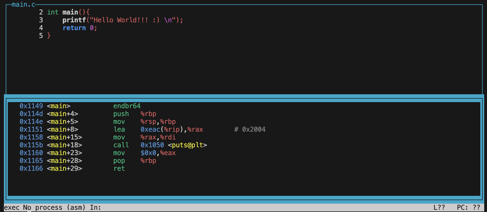

# GDB cheatsheet 

### Installation:

1. Ubuntu
```sh
apt update
apt install -y gdb gcc
```
2. Redhat/Centos/Amazon linux
```sh
yum update
yum install -y gcc gdb
```

### Create binary with debug enabled:

```sh
gcc -o main main.c -s 
# -s --> stripped
# <empty> default not stripped

gcc -o main main.c -g
# -g --> with debug_info
```

### Usgae:

```bash
gdb ./main
```

#### Commands:

1. Press enter(return) key to repeat the last used command.
2. For accessing different layouts. like source code on top space and assembly on bottom.

```bash
layout next
# ( or )
lay next
```
3. set breakpoint
```sh
# break [ <function name> | <line number> ]
break main
```
4. run debugger
```bash
run
```